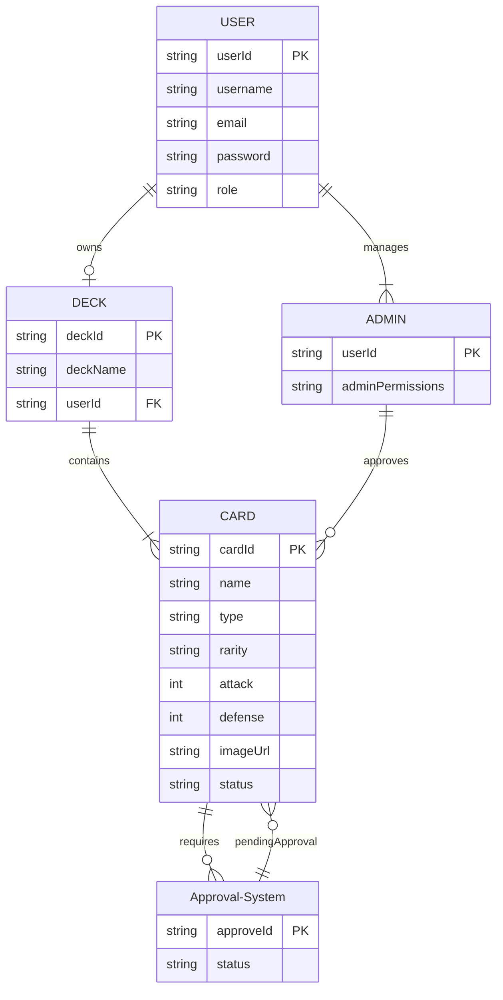

#   <p align="center">Diagrams</p>


## Entity-Relationship Diagram(ERD)



---

## User Flow Diagram

  ```mermaid
  flowchart TD
    A[Start] --> B[View Cards]
    B --> C[Create Deck]
    C --> D[Add Cards to Deck]
    D --> E[Submit Deck]
    E --> F[Admin Approves Deck]
    F --> G[View Deck]
    F --> H[Reject Deck]
    A --> I[Submit New Card]
    I --> J[Admin Approves Card]
    J --> K[Card Approved]
    K --> B
    H --> B
    subgraph Admin
        F --> L[Add New Card]
        F --> M[Modify Existing Cards]
        F --> N[Delete Cards]
    end
    classDef admin fill:#f9f,stroke:#333,stroke-width:4px;
    class Admin admin;

  ```

  ---

  ## System Architecture Diagram

  ```mermaid
        graph TB
          subgraph Frontend
            A[User Interface] --> B[Card Display]
            A --> C[Deck Management]
            A --> D[Card Submission]
            A -->|Authenticate User| E[Authentication Service]
          end

          subgraph Backend
            B -->|Fetch Cards| F[Database]
            C -->|Manage Decks| F
            D -->|Submit Card| F
          end

          subgraph AccesssControl
            G[User Deck Management] -->|Access Cards, Manage Deck| A
            H[Admin Dashboard] --> |Manage Cards| B
            H -->|Approve Card Submissions| D
          end

          E -->|User Data| F

          class A,B,C,D frontendClass;
          class F backendClass;
          class E,G,H databaseClass;
          class G,H accessControlClass;
            

```

---

  ## API Endpoints Table
      
   | **Endpoint**                  |  **HTTP Method**  |        **Description**                 |     **Authorization/Authentication**    |
   |-------------------------------|-------------------|----------------------------------------|-----------------------------------------|
   | `/cards                       | `GET`             | Calls for all cards                    | Public                                  |
   | `/cards/submit                | `POST`            | Submits a new card (pending approval)  | User                                    |
   | `/cards/{card/{id}`           | `PUT`             | Modifies an existing card              | Admin                                   |
   | `/cards/{card/{id}`           | `DELETE`          | Deletes a card                         | Admin                                   |
   | `/decks`                      | `GET`             | Fetches all decks for a user           | User                                    |
   | `/decks/create`               | `POST`            | Creates a new deck                     | User                                    |
   | `/decks/{id}`                 | `PUT`             | Edit a deck                            | User                                    |
   | `/decks/{id}`                 | `DELETE`          | Delete a deck                          | User                                    |
   | `/decks/{id}`                 | `GET`             | Calls for a certain deck               | User                                    |
   | `/admin/approve_card`         | `POST`            | Approves a card from a deck            | Admin                                   |
   | `/admin/approve_deck`         | `POST`            | Approves a submitted deck              | Admin                                   |
   | `/admin/auth/login`           | `POST`            | User login                             | Public                                  |
   | `/admin/auth/logout`          | `POST`            | User logout                            | User                                    |
